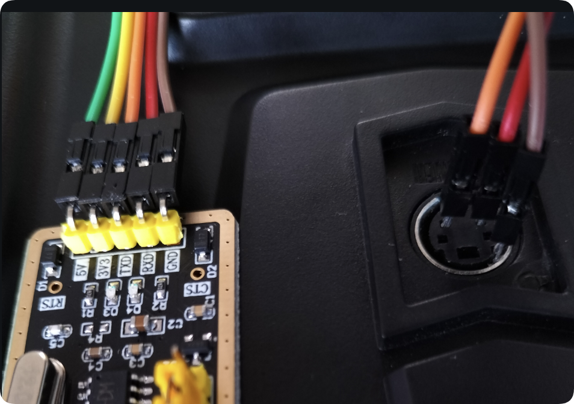

# FS-i6遥控器使用手册VGD

包括刷固件、移植代码等。

## 0 简略介绍

FS-i6 是富斯（FlySky）的入门级航模遥控器。其性价比高、可扩展性强，适用于航模和其他用途。

## 1 遥控器、接收器的使用

FS-iA6B 自带舵机信号（PWM 等，用于航模），也有串口（IBUS 协议），使用单片机串口可接收。

### 1.1 交互方式

遥控器包括以下几个交互方式，共 10 个通道：

| 交互方式 | 数量                 |
| -------- | -------------------- |
| 摇杆     | 4(2 摇杆 * 2 自由度) |
| 旋钮     | 2                    |
| 两档开关 | 3                    |
| 三档开关 | 1                    |

### 1.2 遥控器显示

1. 电压

   显示自己的电压（TX），右上角显示电量

   连接上接收器，会显示其电压（RX）（**看有没有此项，可判断是否连上接收器**）

2. 信号

   连上接收器，会显示信号强度，感觉没什么用（？）

### 1.3 接收器引脚

从接收器右侧看：

上方 IBUS 串口：

| GND  | VCC  | 传感器 IBUS 信号线 | GND  | VCC  | 输出 IBUS 信号线 |
| ---- | ---- | ------------------ | ---- | ---- | ---------------- |

下侧舵机接口：

|        | CH1 / PPM | CH2  | CH3  | CH4  | CH5  | CH6  | 电源/对码线接口 |
| ------ | --------- | ---- | ---- | ---- | ---- | ---- | --------------- |
| signal | s         | s    | s    | s    | s    | s    | s               |
| VCC    | +         | +    | +    | +    | +    | +    | +               |
| GND    | -         | -    | -    | -    | -    | -    | -               |


### 1.4 绑定接收器

1. 遥控器和接收器断电
2. 接收器：对码线插到下侧对码线口，使用上方的 GND、VCC 5V 供电
3. 遥控器：按住 BIND 开机
4. 连接成功后关闭遥控器与接收机电源，重新上电即可正常通信

### 1.5 其他特性

1. 开机时，所有开关要拨到最高，左摇杆拉到最下面（因为是为航模设计，有特别安全措施）
2. 10 分钟未操作有警告声提示

## 2 驱动代码接口

### 2.1 连线和串口配置

使用任一串口直接连接，注意需要有供电，只有 RX 没有发送数据。

| 波特率 | 数据位 | 停止位 | 校验方式 |
| ------ | ------ | ------ | -------- |
| 115200 | 8      | 2      | even     |

### 2.2 API（接口）

提供一对 C 语言的 fsi6.c 和 fsi6.h 文件，移植时都加入工程，include 头文件即可。

头文件中提供了以下接口：

| 接口                                                         | 类型       | 作用                                                         |
| ------------------------------------------------------------ | ---------- | ------------------------------------------------------------ |
| FSi6_Def_t                                                   | 结构体类   | 数据                                                         |
| void FSi6_Init(FSi6_Def_t *fsi6)                             | 函数       | 初始化                                                       |
| bool FSi6_Parse(FSi6_Def_t *fsi6, uint8_t *data, uint8_t len) | 函数       | 解析数据，接收数据指针和其长度。<br />若解析失败、数据错误返回0，否则1。 |
| FSI6_UP                                                      | 宏定义值   | 开关高档（0）                                                |
| FSI6_MID                                                     | 宏定义值   | 开关中档（1）<br />仅开关 B 有此值                           |
| FSI6_DOWN                                                    | 宏定义值   | 开关低档（2）                                                |
| FSI6_MAX                                                     | 宏定义值   | 通道最大值（1000）                                           |
| FSI6_ZERO                                                    | 宏定义值   | 通道中值（0）                                                |
| FSI6_MIN                                                     | 宏定义值   | 通道最小值（-1000）                                          |
| FSI6_JOY_LX(FSi6_Def_t *fsi6)                                | 宏定义函数 | 获取左摇杆 X 值<br />范围为上“通道”的宏定义值                |
| FSI6_JOY_LY(FSi6_Def_t *fsi6)                                | 宏定义函数 | 左摇杆 Y 值                                                  |
| FSI6_JOY_RX(FSi6_Def_t *fsi6)                                | 宏定义函数 | 右摇杆 X 值                                                  |
| FSI6_JOY_RY(FSi6_Def_t *fsi6)                                | 宏定义函数 | 右摇杆 Y 值                                                  |
| FSI6_VR_A(FSi6_Def_t *fsi6)                                  | 宏定义函数 | 旋钮 A 值<br />范围为上“通道”的宏定义值                      |
| FSI6_VR_B(FSi6_Def_t *fsi6)                                  | 宏定义函数 | 旋钮 B 值                                                    |
| FSI6_SW_A(FSi6_Def_t *fsi6)                                  | 宏定义函数 | 开关 A 值<br />范围为上“开关”的宏定义值，只有“高”、“低”两档  |
| FSI6_SW_B(FSi6_Def_t *fsi6)                                  | 宏定义函数 | 开关 B 值                                                    |
| FSI6_SW_C(FSi6_Def_t *fsi6)                                  | 宏定义函数 | 开关 C 值<br />特有“中档”值，因为是三档开关                  |
| FSI6_SW_D(FSi6_Def_t *fsi6)                                  | 宏定义函数 | 开关 D 值                                                    |
| FSI6_STATUS(FSi6_Def_t *fsi6)                                | 宏定义函数 | 返回状态：<br />RC_OFFINLE、RC_ONLINE、RC_ERROR              |
| FSI6_OFFLINE(FSi6_Def_t *fsi6)                               | 宏定义函数 | 离线检测，是返回 1，否则 0                                   |

## 3 改刷固件

FS-i6 默认 6 通道输出，通过刷写固件，可升级至 10 通道。

### 3.1 接线

使用 USB-TTL 就可以刷固件。RX 插入左下，TX 插入右下，GND 插入外边金属圈可以接触的位置。



### 3.2 遥控器操作

遥控器选择：系统 --> 更新固件 --> Yes --> 遥控器黑屏，然后遥控器不要关机。

### 3.3 刷固件

[固件程序](source\10ch_MOD_i6_Programmer_V1_5)

打开设备管理器，，插上 USB-TTL 模块，找到刚出现的端口号。

打开刷机程序，在下拉菜单找到这个端口，下方显示版本号。

点击 Program，进度条完成即刷好。

### 3.4 加通道

打开遥控器，长按 OK 键，选择 FNUCTION --> Aux. channels --> 依次选择为 VRA VRB SWA SWB SWC SWD --> 长按 cancel 保存退出。

## 4  i-Bus 协议通信

IBUS 是富斯专属串行通信协议，支持多通道数据同步传输，是遥控器与机器人控制器（如 STM32、Arduino）通信的核心方式。以下从协议规格、硬件配置、数据解析三方面详细说明：

### 4.1 IBUS 协议

| 协议参数     | 规格细节                                                     |
| ------------ | ------------------------------------------------------------ |
| 通信参数     | 波特率 115200bps，数据位 8，无校验位（N），停止位 1（8N1）；AFHDS3 协议版本下为 2 停止位，需注意匹配 |
| 数据帧结构   | 一帧共 32 字节，帧头固定为 `Byte1=0x20`、`Byte2=0x40`，Byte3~Byte30 为通道数据，Byte31~Byte32 为校验和 |
| 校验和计算   | `Checksum = (Byte1 + Byte2 + ... + Byte30) ^ 0xFFFF`（Byte31 = 校验和低 8 位，Byte32 = 校验和高 8 位） |
| 数据范围     | 标准值 1000~2000（对应舵机 PWM 信号 1ms~2ms），中值 1500     |
| 大支持通道数 | 最大支持 18 通道（AFHDS3 协议），但实际使用需匹配遥控器 / 接收机硬件（如 i6+IA6B 只支持 8 通道） |

### 4.2 连线

需要 5V 供电

```plaintext
VCC（5V）          → 高电平端VCC      → 不接（独立供电）
GND                → GND             → GND（共地）
DATA（IBUS输出）    → 高电平端TX       → 低电平端RX（PA10）
```

### 4.3 数据解析

**解析流程**：

1. 帧头验证：判断前两字节是否为 `0x20` 和 `0x40`，不匹配则丢弃

2. 校验：计算 Byte1 \~ Byte30 的和并异或 `0xFFFF`，与 Byte31 \~ Byte32 组成的校验和对比，不匹配则丢弃

3. 数据提取：按协议拆分 Byte3~Byte30，提取各通道值

   协议：[富斯AFHDS3 IBUS 协议通道数据格式公布公告](https://www.flyskytech.com/info_detail/18.html)

## 5 参考资料

1. [使用stm32解析富斯i6接收机（IBUS协议）-CSDN博客](https://blog.csdn.net/m0_51220742/article/details/123791062)
2. [航模.fs.ia6b 接收机记录 - Mojies - 博客园](https://www.cnblogs.com/mojies/p/17300963.html)
3. [富斯AFHDS3 IBUS 协议通道数据格式公布公告](https://www.flyskytech.com/info_detail/18.html)
4. [富斯AFHDS3 ibus 协议通道数据格式公布公告 | Flysky](https://www.flysky-cn.com/chinese-blog-1/2019/9/28/afhds3-ibus-)
5. [[FPV穿越机](教程)教你富斯i6如何刷十通道_哔哩哔哩_bilibili](https://www.bilibili.com/video/BV1EW411k73i/?vd_source=0ccdd404cdaad86e9cdbebc038ba6fdd)